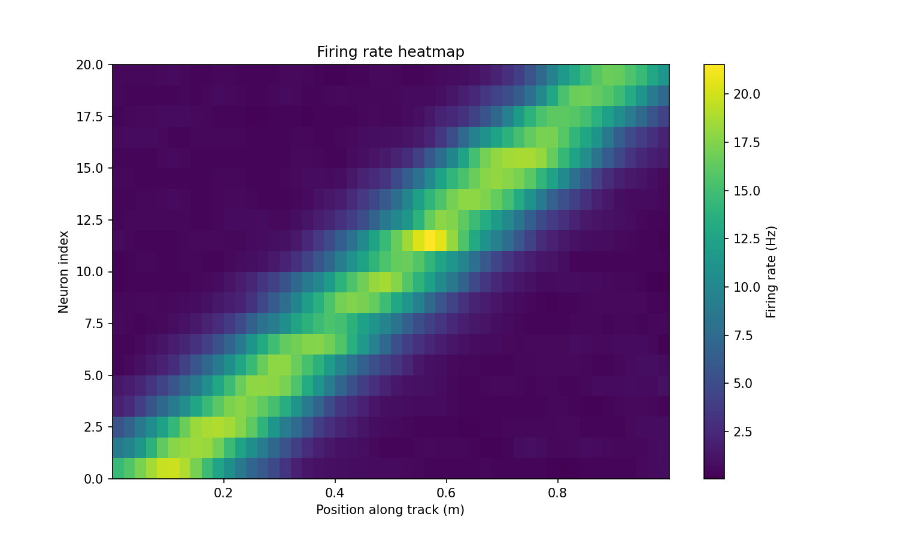

# Place cell simulation

**Generate synthetic hippocampal place-cell spike and noisy spikes, with realistic movement along a linear track.**  

Place cells are neurons in the hippocampus that are active when an animal is in a specific location, encoding spatial features used in spatial navigation and memory. 

The figure below shows an example ratemap generated with this repo: each row corresponds to a simulated place cell, with high firing in its “place field” (a specific region of the track) and low activity elsewhere.



This lightweight research-focused toolkit can be used to simulate neural data for testing decoders, representation analyses, and latent feature discovery workflows.

## Overview

```
place-cell-simulations/
├── README.md
├── requirements.txt
├── setup.py
├── src/
│   ├── __init__.py
│   ├── spikes.py # to generate place cells neural data and noise
│   ├── movement.py # to simulate movement of an animal along a 1D track
│   ├── utils.py # utilities for rates computation across positions
│   └── plots.py # plotting functions
├── notebooks/ # clean notebook demonstrating usage
└──  examples/ # example runner script that generates a toy dataset and a preview figure
```

## Quick start

Recommended: create a virtual environment first

```bash
# from repo root
python3 -m venv .venv
source .venv/bin/activate         # macOS / Linux
# .\.venv\Scripts\activate        # Windows PowerShell

# install package in editable mode 
pip install -e .

# install requirements
pip install -r requirements.txt
```

## Minimal usage 

```
import place_cell_simulations as pcs

# simulate movement along linear track
traj = pcs.generate_trajectory(track_length = 1.0, dt = 0.005, duration_s = 300.0, theta = 1.0, mu = 0.0, sigma = 0.4, v0 = 0.0)

# parameters for place cells
n_cells = 20
centers = np.linspace(0.1, 0.9, n_cells) # place field centers
sigmas = np.full(n_cells, 0.1) # place field size
peak_rates = np.random.uniform(5, 20, n_cells)
baseline_rate = 0.5
    
# generate spikes 
spikes = pcs.generate_place_cell_spikes(centers, sigmas, peak_rates, baseline_rate,
                               traj['pos'], traj['time'], traj['dt'])

# generate ratemap plot
fig = pcs.plot_rate_maps(spikes = spikes, positions = traj["pos"], times = traj["time"], n_bins = 50, smooth_sigma = 1.0)
```
## Features
- Generate synthetic place cells, with bidirectional Gaussian place fields. 
- Create noisy neurons, randomly active along the track.
- Simulate a trajectory along the linear track using Ornstein–Uhlenbeck equation. 
- Option to generate a trajectory along the linear track undersampling one end of the track. 
- Output spike matrix and position and time vectors.

## Contact

Maintainer: Sara Molas Medina. Open issues or PRs for questions, bugs, or feature requests.

## Citations 

DOI: 10.5281/zenodo.17196242
